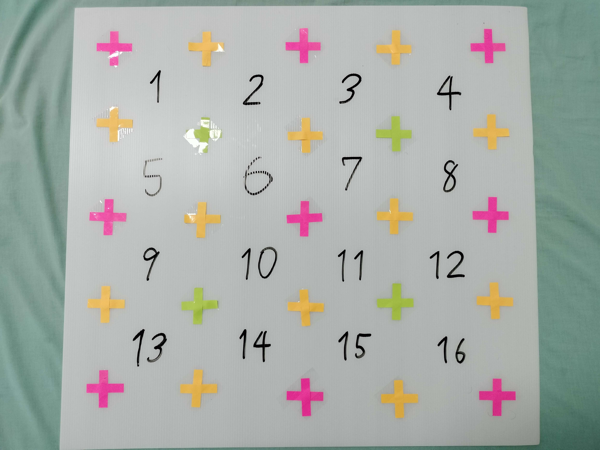
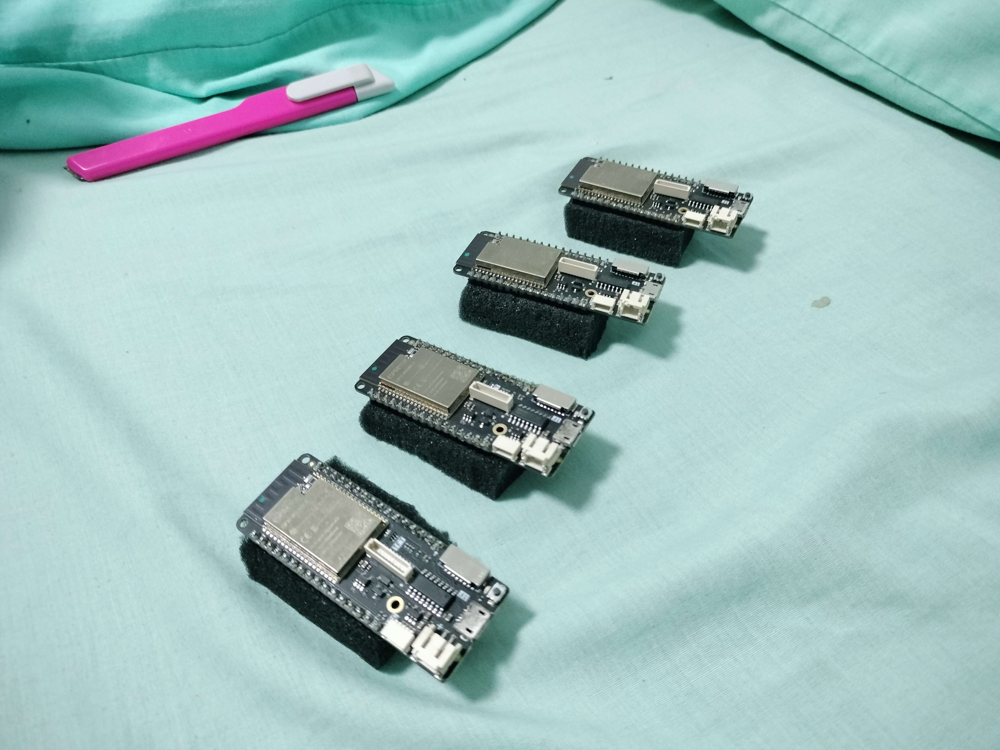
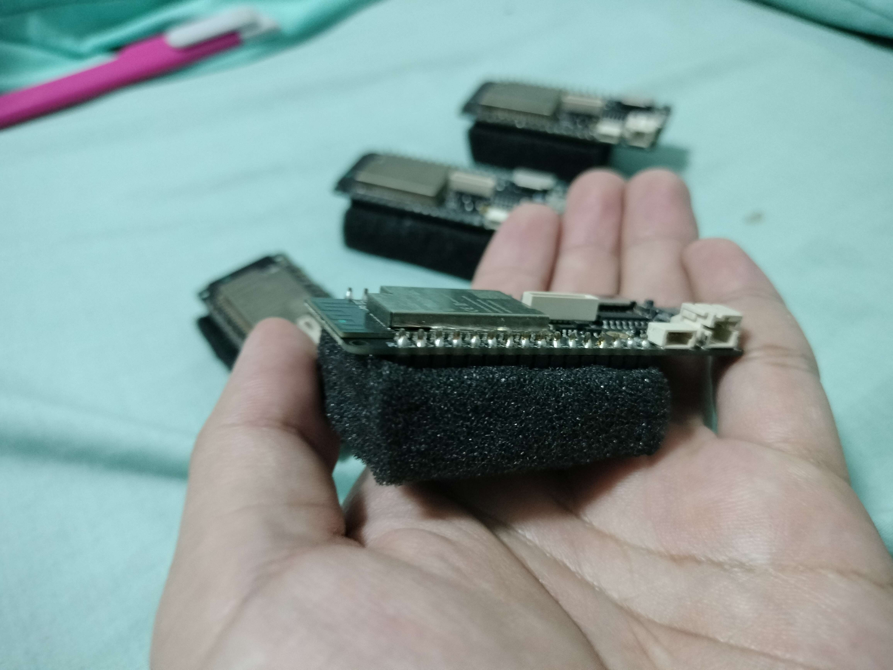
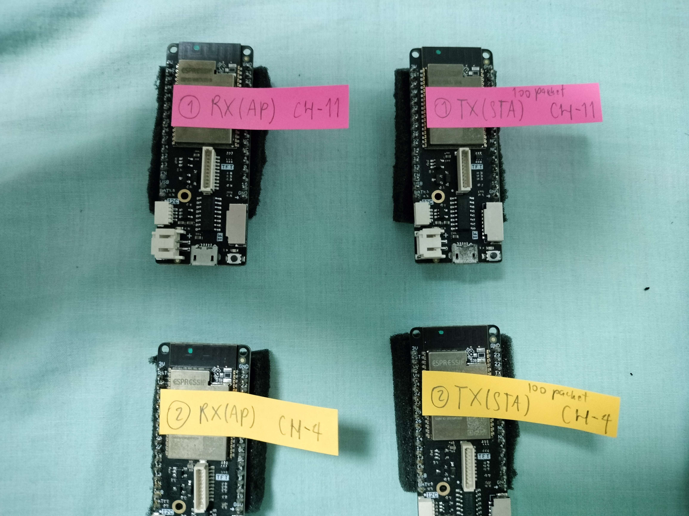
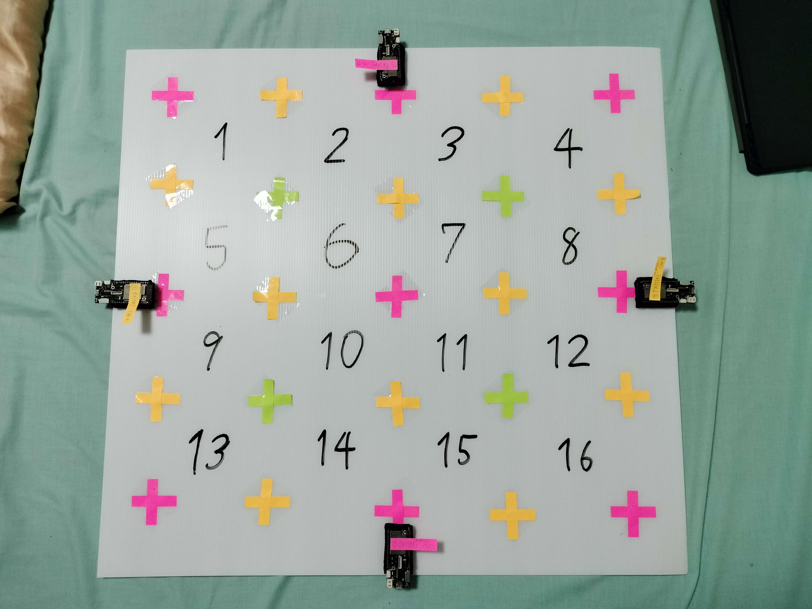
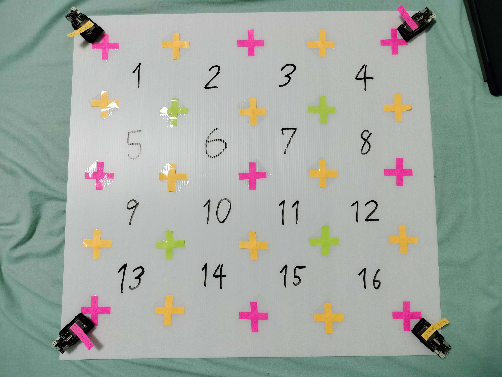

# Environment Design & setup

In this case

* I use Future board (That is what Thai people called it) which is the size of 61x65 cm
* Label the the corner of each area with simple post-it note and tape it down using scotch-tape
* Also gives some room for ESP32 placement, as you can see I don't use entire space.
* Lastly label the number on each area with marker pen

<!--  -->

    

For this project I uses LOLIN D32 PRO but be noted that all ESP32 are all the same on this project anyway.

Attach some platform to all 4 of ESP32 (in this case I use sponge. The thickness is 1.5cm)

<!-- 
 -->

  
   

And label all 4 of them with post-it

  

* 1 RX(AP) CH-11
* 1 TX(STA) 100 packet CH-11
* 2 RX(AP) CH-4
* 2 TX(STA) 100 packet CH-4

# How ESP32 placement can affect ESP32 communication (theorically)

Let's back down and think for a little bit as We don't really have clue how ESP32 emit the CSI data due to the invisiblity of the wave.

But theorically ESP32 should emit the wave most intensely in front more than the side. And emit the signal very small in the back of ESP32. And please note that wifi emission is in spherical shape with cone-shape of intensity.

So we can roughly split area of signal intensity like this.

  

where

* green = highest
* yellow = medium
* red = low
* black = lowest

Consider the position in red and black area "blind spot"

Now let's compare which theorically could be the best placement for ESP32 between `putting on the rectangle's sides` and `putting in the corner`

|                      | putting on the rectangle's sides                              | putting in the corner                                 |
| -------------------- | ------------------------------------------------------------- | ----------------------------------------------------- |
| image                |                |                |
| heatmap image pair 1 |  |  |
| heatmap image pair 2 |  |  |
| description          | Area number 4 is in blind spot twice.                        | No special area is considered in blind spot           |

So for this project I'll go with `putting in the corner` style.
Where bottom left is pair 1 RX and bottom right is pair 2 RX.
and top left is pair 2 TX and top right is pair 1 TX.

However be noted that CSI data is very sensitive. So the style of placement night not really matter as much here.

Alright! Tape or Glue ESP32 down and we are ready to go with hardware setup!

Continue with `README2.md`
