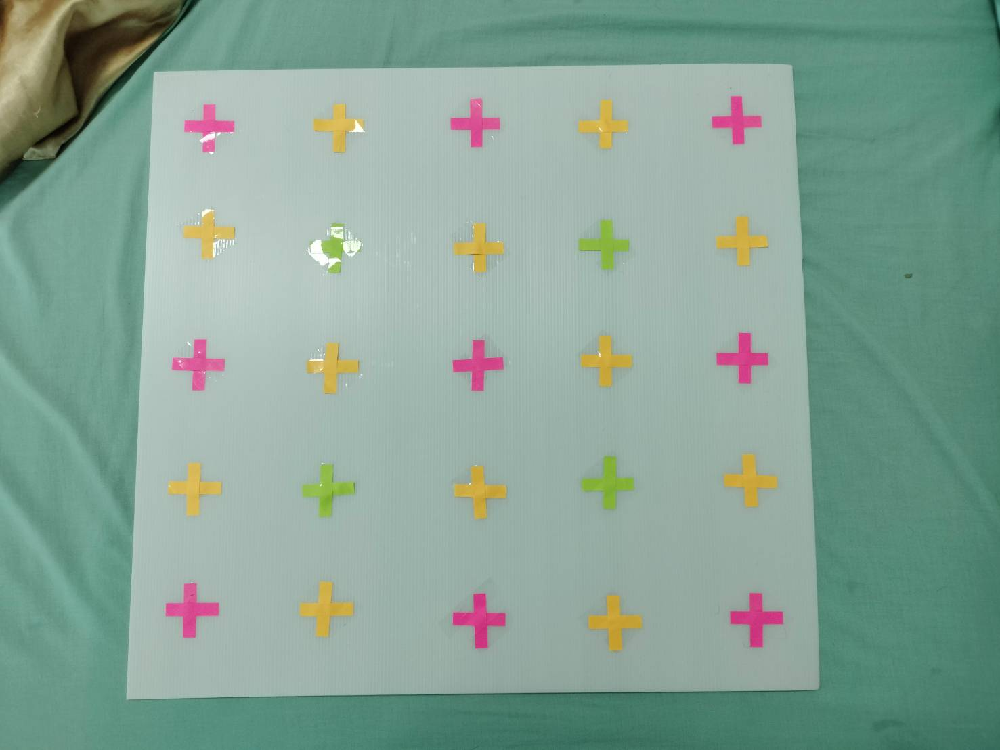

# Environment Design & setup

Prepare some solid board and tape the border of area in each position.

In this case

* I use Future board (That is what Thai people called it) which is the size of 61x65 cm
* Label the the corner of each area with simple post-it note and tape it down using scotch-tape
* Also gives some room for ESP32 placement, as you can see I don't use entire space.

# How ESP32 placement can affect ESP32 communication (theorically)

Let's back down and think for a little bit. We don't really have clue how ESP32 emit the CSI data

But theorically ESP32 should emit the wave most intensely in front more than the side. And emit the signal very small in the back of ESP32. And note that wifi emission is sphere with cone-shape intensity.
